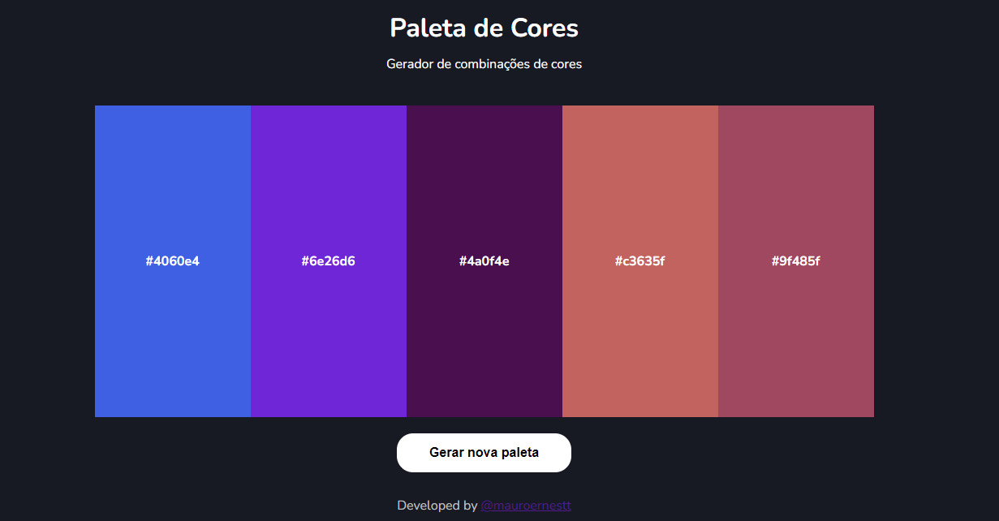

**Gerador de Cores (Palette) **

## Descrição do Projeto

O Gerador de Cores (Palette) é uma aplicação web desenvolvida com HTML, CSS e JavaScript que permite aos usuários criar paletas de cores personalizadas de forma simples e interativa. Com esta aplicação, os usuários podem gerar combinações de cores, visualizar as cores em tempo real e copiar os códigos hexadecimais das cores geradas para uso em projetos de design, desenvolvimento web ou qualquer outra aplicação que requeira cores personalizadas.

## Funcionalidades

- **Geração de Cores Aleatórias:** Os usuários podem gerar cores aleatórias clicando em um botão específico. Isso é útil para obter inspiração ou criar paletas diversificadas.
- **Visualização em Tempo Real:** As cores selecionadas ou geradas são exibidas em tempo real, permitindo que o usuário veja o resultado antes de copiar os códigos hexadecimais.
- **Cópia dos Códigos Hexadecimais:** Os usuários podem copiar facilmente os códigos hexadecimais das cores geradas com apenas um clique, tornando mais conveniente a utilização das cores em outros projetos.

## Como Utilizar

1. Acesse o projeto através do link: [Link do Projeto](https://mauropequenino.github.io/ColorPaletteGenerator/)
2. Na interface da aplicação, você encontrará um botão com a opção de "Gerar Cor Aleatória". Clique nele para obter uma cor aleatória e adicionar à paleta.
3. A paleta de cores será exibida abaixo do gerador, mostrando todas as cores selecionadas ou geradas.
6. Agora você pode usar as cores copiadas em seus projetos ou designs!

## Pré-requisitos

- Navegador web atualizado com suporte a HTML5, CSS3 e JavaScript.
